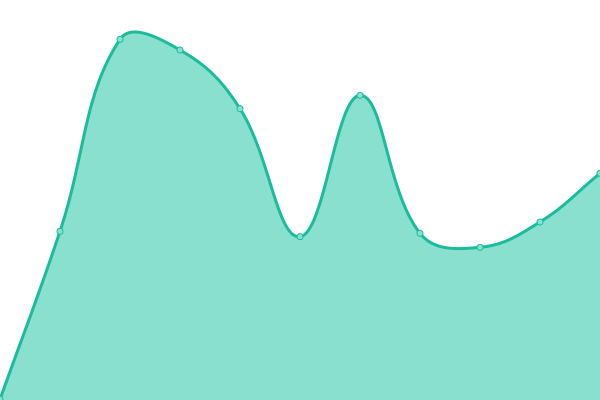

# [📈 Live Status](https://status.utopium.tk): <!--live status--> **🟩 All systems operational**

This repository is an automated status page for [Team Utopium](https://utopium.tk)

<!--start: status pages-->
<!-- This summary is generated by Upptime (https://github.com/upptime/upptime) -->
<!-- Do not edit this manually, your changes will be overwritten -->
<!-- prettier-ignore -->
| URL | Status | History | Response Time | Uptime |
| --- | ------ | ------- | ------------- | ------ |
| [Werewolf Utopium](https://werewolf-utopium.tk) | 🟩 Up | [werewolf-utopium.yml](https://github.com/thewilloftheshadow/utopium-status/commits/master/history/werewolf-utopium.yml) | 

 309ms
     
 | 

   

| [Spyfall Utopium](https://spyfall.utopium.tk) | 🟩 Up | [spyfall-utopium.yml](https://github.com/thewilloftheshadow/utopium-status/commits/master/history/spyfall-utopium.yml) | 

 234ms
     
 | 

   

<!--end: status pages-->
